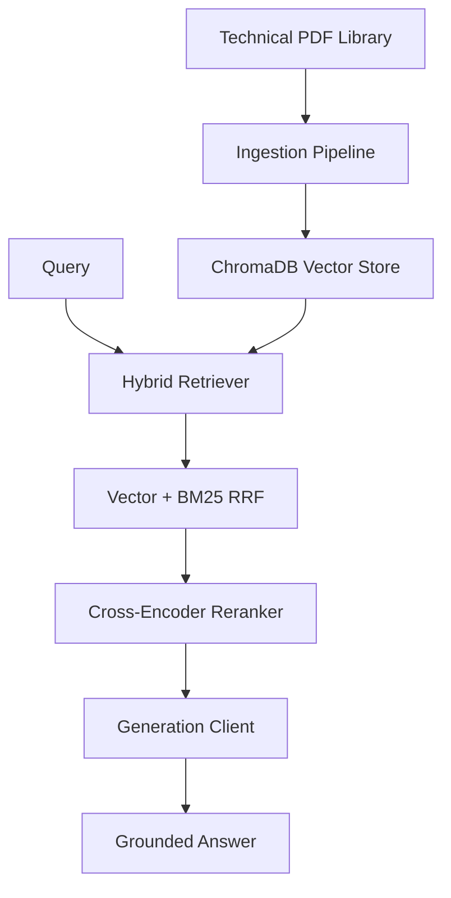

# Climate Retrieval-Augmented Generation (RAG) System

A robust technical assistant designed to search and reason across climate documentation. This system uses advanced retrieval and reranking strategies to ensure high-fidelity answers with precise source attribution.

## System Architecture

The following diagram illustrates the flow from document ingestion to grounded response generation.



## Technical Implementation

### Hybrid Retrieval
The system uses a two-stage retrieval process. First, a hybrid search combines semantic vector matching (BAAI/bge-m3) with keyword-based BM25 search. These results are merged using Reciprocal Rank Fusion (RRF).

### Cross-Encoder Reranking
Retrieved candidates are re-scored using the BAAI/bge-reranker-v2-m3 model. A second fusion stage combines the retriever rank with the cross-encoder rank to ensure stable and accurate document promotion.

### Grounded Generation
Answers are generated using Llama 3.3 70B via the Groq API. The system includes a local Ollama fallback (Qwen 2.5) to maintain availability if the primary API is unreachable.

## Key Metrics

Our evaluation suite measures retrieval performance using standard information retrieval metrics.

| Metric | Score | Note |
| :--- | :--- | :--- |
| **Recall@1** | 0.7094 | Primary accuracy target |
| **Recall@5** | 0.8889 | Retrieval ceiling |
| **Latency** | ~4.8s | P50 Reranking time |

## Usage

### Ingestion
Process your technical PDF library into the vector store.
```bash
python ingest.py
```

### Application
Launch the search interface.
```bash
streamlit run app.py
```

### Evaluation
Measure the performance of the system.
```bash
python run_contextual_eval.py
```

Designed for precision. Built for reliability.
